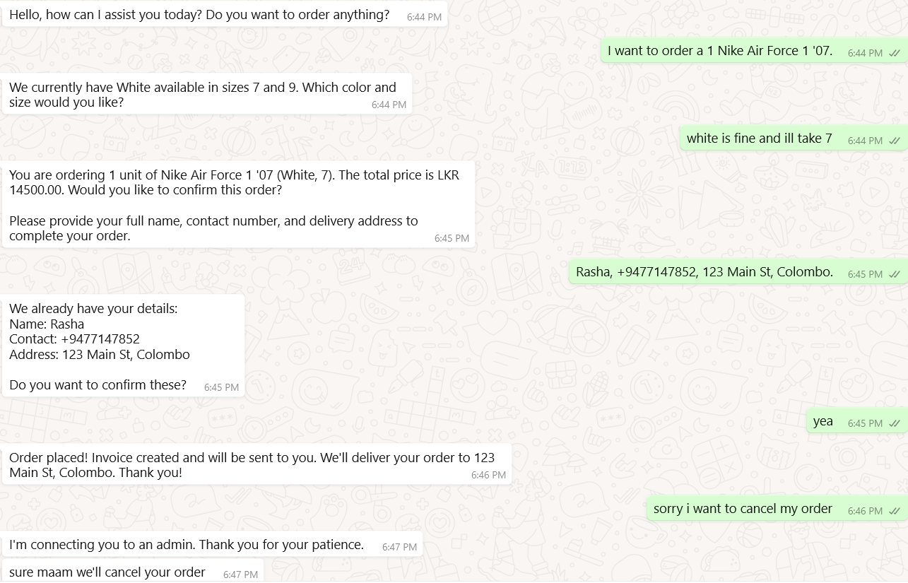
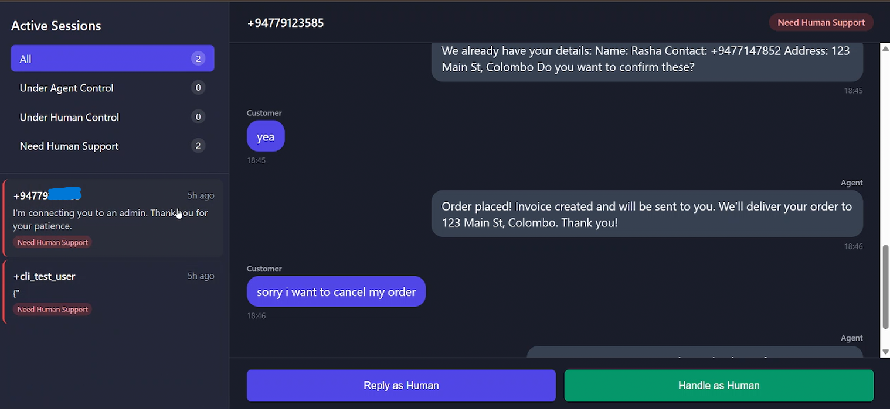

# rt-aut-demo - AI-Powered Order Assistant

rt-aut-demo is a WhatsApp Order Assistant for e-commerce with human support integration. Customers can check products, place orders, and get connected to human agents when needed.

## What it does

- **WhatsApp Orders**: Customers chat via WhatsApp to browse products and place orders
- **Stock Checking**: Real-time inventory checking with product variants (colors, sizes)
- **Order Processing**: Automatic invoice generation and Google Sheets integration  
- **Human Takeover**: Dashboard for staff to take over conversations when needed
- **Email Alerts**: Notifications when human support is required

## Installation

1. Clone the repository
```bash
git clone https://github.com/nshth/rt-aut-demo.git
cd rt-aut-demo
```

2. Install dependencies
```bash
pip install -r requirements.txt
```

3. Set up environment variables
```bash
cp .env.example .env
# Edit .env with your API keys and settings
```

4. Run the application
```bash
python -m uvicorn backend.main:app --reload
```

## Required Services

- **Twilio**: WhatsApp messaging
- **Groq**: AI chat responses  
- **Redis**: Session storage
- **Google Sheets**: Order tracking
- **Email**: Staff notifications

## Usage

### For Customers
Text the WhatsApp number to:
- Browse products
- Check availability 
- Place orders
- Get help

  **WhatsApp Order Flow**
  

### For Staff
Visit `/hitl/` dashboard to:
- Monitor active chats
- Take over from bot
- Reply as human agent

  **Staff Dashboard**
  

## Project Structure

```
backend/
├── agent/          # AI chat logic
├── db/            # Database models
├── logic/         # Business logic
├── routes/        # API endpoints
└── service/       # External services

frontend/          # Human dashboard UI
```

## Contributing

Pull requests welcome. Please test your changes with the Twilio sandbox before submitting.